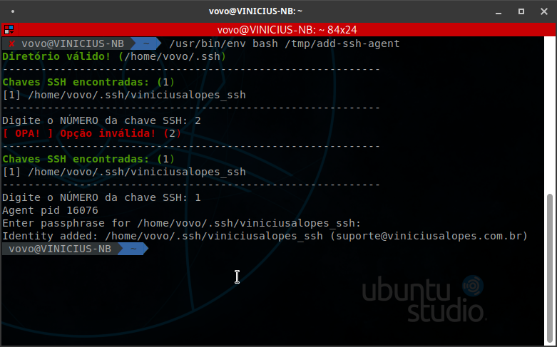

# add-ssh-agent:

## O que faz este script?
 
- Verifica se existe o diretório padrão para chaves ssh (/home/user/.ssh);

- Exibe um menu com a lista de chaves disponíveis;

- Inicia o ssh-agent;

- Adiciona a chave ssh selecionada ao __ssh-agent__.


## O que falta esse script fazer?

Está nos meus planos, verificar qual é o sistema operacional e disponibilizar a adição da chave no ssh-agent para Windows.

## Instruções

Em um emulador de terminal, execute os comandos abaixo:

- Para fazer o download do script

```wget https://raw.githubusercontent.com/Viniciusalopes/add-ssh-agent/master/add-ssh-agent -O /tmp/add-ssh-agent```

- Para executar o script

```/usr/bin/env bash /tmp/add-ssh-agent```

## Onde funcionou

- __UBUNTU STUDIO 19.10__

```
NAME="Ubuntu"
VERSION="19.10 (Eoan Ermine)"
ID=ubuntu
ID_LIKE=debian
PRETTY_NAME="Ubuntu 19.10"
VERSION_ID="19.10"
HOME_URL="https://www.ubuntu.com/"
SUPPORT_URL="https://help.ubuntu.com/"
BUG_REPORT_URL="https://bugs.launchpad.net/ubuntu/"
PRIVACY_POLICY_URL="https://www.ubuntu.com/legal/terms-and-policies/privacy-policy"
VERSION_CODENAME=eoan
UBUNTU_CODENAME=eoan

Linux VINICIUS-NB 5.3.0-29-lowlatency #31-Ubuntu SMP PREEMPT
Fri Jan 17 18:32:27 UTC 2020 x86_64 x86_64 x86_64 GNU/Linux
```

## Saída



---

### FONTES
[Ajuda do GitHub](https://help.github.com/pt/github/authenticating-to-github/generating-a-new-ssh-key-and-adding-it-to-the-ssh-agent)

---

Vovolinux: Sem trauma e sem teoria!
